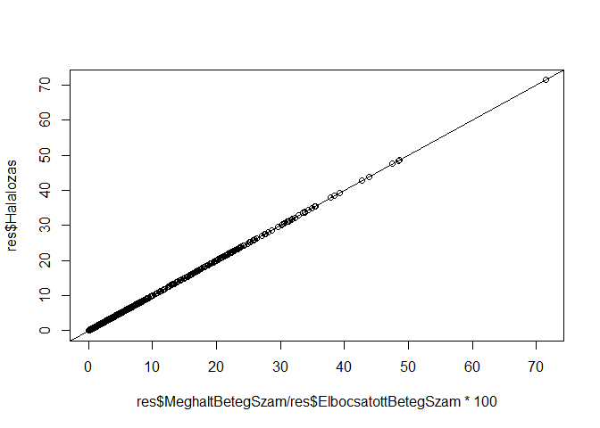

Az 1993 és 2002 közötti magyar kórházi ágyszám- és betegforgalmi
kimutatások digitalizációja
================
Ferenci Tamás (<https://www.medstat.hu/>)<br>
2025. december 27.

- [Összefoglaló](#összefoglaló)
- [Motiváció](#motiváció)
- [A megoldás módszere](#a-megoldás-módszere)
- [Tanulságok](#tanulságok)
- [Technikai részletek](#technikai-részletek)
- [Adatbeolvasási megállapítások](#adatbeolvasási-megállapítások)
  - [2001](#2001)
  - [2002](#2002)

## Összefoglaló

- 1993 óta minden évben megjelenik az ún. Kórházi ágyszám- és
  betegforgalmi kimutatás, mely a hazai kórházi rendszer jellemzőinek
  legátfogóbb, nyilvánosan elérhető adatbázisa.
- Egy [korábbi
  projektemben](https://github.com/ferenci-tamas/korhaz-agyszam-betegforgalom-halalozas)
  letöltöttem és gépi úton feldolgozhatóvá tettem a 2003 után kiadott
  kimutatásokat, melyek elérhetőek elektronikus formában a Nemzeti
  Egészségbiztosítási Alapkezelő honlapján.
- A 2003 előtti kimutatások azonban nincsenek fent ezen a honlapon, és,
  mint kiderült, máshol sem, ugyanis nem is léteznek elektronikus
  formában – ezekből eleve is csak papíralapú változatot nyomtattak.
  Éppen ezért egy új projektet indítottam, melynek célja ezen könyvek
  digitalizálása, a bennük lévő adatok elektronikus formára konvertálása
  és nyilvános közzététele gépi feldolgozásra is alkalmas formátumban.
- A projekt célja kettős. Ezen adatok történelmünk egy szeletét
  dokumentálják; én úgy tekintem, hogy ez egyfajta örökségünk, amit
  fontos, hogy akár az érdeklődők, akár a jövő történészei, egyáltalán,
  a következő generációk számára megőrizzünk. Ennek biztonságosabb
  formáját jelenti, ha ezek az információk nem csak papíron, hanem
  elektronikusan is megvannak. Másrészt ha az adatokat gépi úton
  feldolgozható formában is elérhetővé tesszük, akkor a puszta
  megőrzésen túl azt is elősegjük, hogy olyan elemzések tudjanak
  elkészülni, melyek a jelenleginél egy évtizeddel visszább tudnak
  menni, ennyivel nagyobb időbeli átfogásban tudják vizsgálni a magyar
  kórházi rendszer alakulását.
- Az [Országos Egészségtudományi Szakkönyvtár](https://medinfo.aeek.hu/)
  rendkívüli segítőkészségről téve tanúbizonyságot vállalta a könyvek
  szkennelésének fáradságos munkáját. Ezt köszönöm a könyvtár valamennyi
  dolgozójának, név szerint külön is Balla Andrea könyvtárvezetőnek és
  Kovács Ildikó könyvtárosnak.
- A beszkennelt oldalakat némi grafikai előkészítés után multimodális
  nagy nyelvi modellel ismertettem fel, mely lényegében egy optikai
  karakterfelismerést hajtott végre, de a szokásos módszereknél sokkal
  hatékonyabban, jól megőrizve az adatok táblázatos formátumát is. E
  nélkül valószínűleg lehetetlen lett volna számomra ekkora mennyiségű
  információ gépi úton feldolgozható formátumban történő digitalizálása.
- A felismerés szinte hibátlan volt, de nem feltétlenül tökéletesen
  hibátlan; ez függött az alkalmazott modelltől is. Akárhogy is, gondot
  fordítottam az adatok alapos ellenőrzésére; a véleményem szerint ez
  minden ilyen és ehhez hasonló projektnél fontos kérdés. Ennek
  részleteit és tanulságait is ismertetem itt.
- Ezen az oldalon megadom a teljes kódot is, mely a feldolgozást
  végezte.
- A munka folyamatosan zajlik, egyelőre a 2002-es év feldolgozása
  fejeződött be. Ez az oldal bemutatja a projekt hátterét és
  dokumentálja a haladást.

## Motiváció

1993 óta minden évben megjelenik az ún. Kórházi ágyszám- és
betegforgalmi kimutatás, mely a magyar kórházi rendszer
infrastruktúrájára és teljesítményére vonatkozó legrészletesebb,
nyilvánosan elérhető adatforrás. A Kimutatás tartalmazza valamennyi
magyar fekvőbeteg-ellátó intézmény ágyszámait (külön a működő és
szünetelő ágyak számát), betegforgalmi adatait (felvett betegek számát,
valamint lebontásukat további sorsuk szerint: meghalt, eltávozott, más
osztályra áthelyezett), egynapos ellátási esetszámait, teljesített
ápolási napjainak számát, az ápolás átlagos időtartamát, az
ágykihasználást és a halálozási arányt. Nagyon fontos, hogy mindez nem
csak a kórházra összesen érhető el, hanem szakmák szerint –
belgyógyászat, sebészet stb. – lebontva is.

A fentiekből fakadóan a Kimutatás alapvető adatforrásunk, ha a magyar
kórházi rendszer jellemzőiről, illetve azok időbeli alakulásáról
objektív, megalapozott vizsgálatokat akarunk folytatni. Hogy alakult a
kórházi ágyak száma az elmúlt évtizedekben? Hogy alakult ez szakmánként,
melyiknél csökkent és melyiknél nőtt? Tényleg vannak nagyon kis forgalmú
kórházak, illetve kórházi osztályok? Tényleg egyre több szüneteltett ágy
van manapság? Sikerült növelni az egynapos ellátások arányát? Hogy
alakult a halálozási arány? Ha az ilyen és ehhez hasonló kérdésekre
tudunk válaszolni, az sokszor nem pusztán leíró jellegű megállapítás,
hanem segíti a folyamatok megértését, a múltbeli egészségpolitikai
döntések értékelését, a helyzetünk alaposabb átlátását. (Illusztrálva is
a fenti lehetőséget, néhány kérdésről, melyeket én fontosnak éreztem,
[készítettem](https://github.com/ferenci-tamas/egeszsegpolitika-korhaz)
egy hosszú elemzést, számos vizualizációval, összehasonlítással,
kiegészítve személyes egészségpolitikai véleményemmel.) Itt azonban nem
pusztán elemzésekről van szó: jó esetben, tehát ha a döntések adatokra
alapozva születnek, akkor ezek az információk az egészségügyi tervezési,
irányítási munkát is segítik és így hozzájárulnak a jobb minőségű
döntéshozatalhoz, ezen keresztül pedig az ország egészségi állapotának
javításához.

Ezen elemzések elkészüléséhez azonban természetesen az is fontos, hogy a
kimutatások adatai feldolgozható formában elérhetőek legyenek.

A 2003-as és az utáni kimutatások letölthetőek a Nemzeti
Egészségbiztosítási Alapkezelő (NEAK)
[honlapjáról](https://neak.gov.hu/felso_menu/szakmai_oldalak/publikus_forgalmi_adatok/gyogyito_megelozo_forgalmi_adat/fekvobeteg_szakellatas_stat/korhazi_agyszam)
elektronikus formátumban (PDF, illetve DOC fájlként). A probléma az,
hogy attól még, mert elektronikus, nem dolgozható fel gépi úton, még a
DOC fájlok sem: hiába lehet ezek tartalmához hozzáférni, azok több száz
oldalon keresztül, össze-vissza széttördelt táblázatokban találhatóak
meg, arról nem beszélve, hogy egy dokumentumban csak egyetlen év adatai
találhatóak meg, míg az elemzésekhez jellemzően az időbeli trendek is
fontosak, vagyis össze kell(ene) kapcsolni több év adatait. Ezt a
problémát egy [korábbi
projektem](https://github.com/ferenci-tamas/korhaz-agyszam-betegforgalom-halalozas)
keretében megoldottam: számítógéppel beolvastam a DOC fájlokat,
azonosítottam és összekapcsoltam a táblázatokat, kiszedtem a
tartalmukat, majd egyetlen, gépi úton feldolgozható táblázatba
rendeztem. Ezt végrehajtottam minden évre, és a kapott táblázatokból
létrehoztam egyetlen nagy, immár évet is tartalmazó adattáblát, melyet
különböző, gépi úton feldolgozható formátumokban bárki számára
nyilvánosan elérhetővé tettem, hogy ezzel is segítsem a jó minőségű
elemzések megszületését.

A fenti munka után is nyitva maradt azonban a 2003 előtti kimutatások
kérdése. Vajon hol lehet ezeket elérni? Gyors kereséssel kiderül, hogy
könyvtárakban fellelhetőek könyvként kinyomtatott példányok ezekből, így
az első gondolatom az volt, hogy akkor biztos, hogy ezek is megvannak
elektronikusan is (elvégre valahonnan csak ki kellett nyomtatni, nem?),
csak valamiért nem tették fel a NEAK honlapra. Sajnos azonban csalódnom
kellett. A NEAK-tól azt a tájékoztatást kaptam (Elemzési és Informatikai
Osztály, 2023. május 25.), hogy ezek soha nem készültek el elektronikus
változatban. Egész pontosan, idézem őket: „a 2003 évet megelőző
időszakra vonatkozóan az alapadatokból egy riportgenerátor segítségével
egy nyomtatott példány készült ezen statisztikából, melyet a nyomda
sokszorosított”, tehát a „riportgenerátor kimenete nem egy fileba ment,
hanem rögtön a nyomtatóra”. Vagyis ilyen fájlok azért nem érhetőek el a
honlapon, mert nem is léteznek és soha nem is léteztek.

Most akkor mi legyen? Vesződjünk ezek után egyáltalán ezekkel a régi
kimutatásokkal? Ezek ugyan napjainak aktuális kérdéseinek
megválaszolásához talán már kevésbé fontosak, de én azt gondolom, hogy
igenis van jelentőségük. Ezek az adatok történelmünk egy részéről
szólnak. Igen, történelmünknek csak egy kis szelete az egészségügy (de
egy fontos szelete), és igen, annak is csak egy szelete a kórházi
ellátórendszer (de egy fontos szelete), és persze az is igaz, hogy ezek
az adatforrások még erről a szeletről is csak korlátozott információkat
adnak – de alapvető információkat. Ha már nem tudunk mindent megőrizni,
akkor azt hiszem mondhatjuk, hogy ezek a legalapvetőbb számszerű
információk, amiket amúgy is érdemes megőrizni az utókor számára a
magyar kórházi rendszer alakulásáról. Én úgy tekintem, hogy ez egyfajta
örökségünk, és fontos, hogy akár az érdeklődők, akár a jövő történészei,
egyáltalán, a következő generációk számára megőrizzük.

Éppen ezért arra gondoltam, hogy jó lenne a 2003 előtti anyagokat is
megkeresni és a tartalmukat digitalizálni, részint a hozzáférhetőség
kedvéért – hogy lehessen nagyon hosszú idősoros elemzéseket is végezni,
ha ezek az adatok is feldolgozhatóak gépi úton – részint, hogy még
biztosabban megőrizzük az utókor számára. (Egy megjegyzés ehhez az
utóbbihoz: egyáltalán nem gondolom, hogy a papíralapú változatra nincs
szükség, mert az elektronikus az „jobb” – szokták mondani, hogy a papír
kockázatos, mert elázik, elég, megsárgul stb., de valójában az
elektronikus formátumoknak is megvannak a [maguk
bajai](https://en.wikipedia.org/wiki/Digital_dark_age), így a
legbiztosabb, jövő-állósági értelemben, ha mindkettő megvan. Az
elektronikus további előnye természetesen a gyorsabb kereshetőség és a
feldolgozhatóság.)

Szóval mit tegyünk most?

## A megoldás módszere

A fentiekből fakadóan első lépésben mindenképp szükség van a
kinyomtatott kimutatásokra, illetve azok beszkennelésére. Szerencsére az
[Országos Egészségtudományi Szakkönyvtárban](https://medinfo.aeek.hu/)
fellelhető
[valamennyi](https://medinfokat.aeek.hu/eredmenyek?szemp1=0&kiegtipus_1=&szerzotipus_1=&kiemeltipus_1=&adat1=K%C3%B3rh%C3%A1zi%20%C3%A1gysz%C3%A1m-%20%C3%A9s%20betegforgalmi%20kimutat%C3%A1s&hmuv1=0&szemp2=0&kiegtipus_2=&szerzotipus_2=&kiemeltipus_2=&adat2=&hmuv2=0&szemp3=0&kiegtipus_3=&szerzotipus_3=&kiemeltipus_3=&adat3=&show=0&dokt=0&nyelv=0&rend1=0&csonk=0&annot=0&ocr=n&attach=0&csk=0&db=10&template=normal&showall=%C3%96sszes&form_id=kereses_form&oldal=1)
kimutatás 1993-tól 2002-ig. Felvettem a kapcsolatot a könyvtárral, és
nagyon gyorsan hatalmas segítséget kaptam tőlük: felajánlották, hogy
nekiállnak, és beszkennelik ezeket a könyveket. E nélkül soha nem
valósulhatott volna meg ez a projekt; hálásan köszönöm a könyvtárnak és
valamennyi dolgozójának a segítséget! Szeretném külön is, név szerint
köszönetemet kifejezni Balla Andrea könyvtárvezetőnek, aki az első
pillanattól fogva támogatta a projektet, és Kovács Ildikó könyvtárosnak,
aki a szkennelés fáradságos munkáját végezte.

Ez már megoldja a megőrzés problémáját, de nem oldja meg a
feldolgozhatóságét. Éppen ezért úgy döntöttem, hogy továbbhaladok.

Az első gondolatom az volt, hogy OCR-rel felismertetem a beszkennelt
példányokat, de ezzel nem jutottam sokra. Ugyan megpróbáltam (a
[Tesseract](https://tesseract-ocr.github.io/) nyílt forráskódú OCR
rendszert használva) a felismerést, de az eredmény gyakorlatilag
használhatatlan lett. Még az egyedi számok felismerése sem sikerült túl
jól, de a táblázat struktúra megőrzése gyakorlatilag reménytelen képet
mutatott. Az igazság az, hogy e ponton már majdnem feladtam volna,
amikor támadt egy igazán 2020-as évekbeli ötletem – mi volna ha
megpróbálnánk multimodális nagy nyelvi modellel? („AI segítségével”,
ahogy ma mondani szokták…)

Az eredmény sokkoló(an jó) volt: már első próbálkozásra is nagyon jó –
az OCR-t többszörösen kenterbe verő – megoldást szolgáltatott, némi
finomhangolás után pedig szinte tökéleteset. Egy dolgot azonban ezzel
együtt is fontosnak tartok kiemelni: hatalmas szerencsém volt az
összegzősorok jelenlétével. (A kimutatásban, miután felsorolja egy
kórház összes szakmáját, szerepel egy „összes osztály együtt” sor. Ez,
pár oszloptól eltekintve, egyszerűen a felette lévő sorok összegét
tartalmazza.) A dolgot a hibaellenőrzés miatt érzem kritikusnak: ez
amúgy is fontos lenne, de egy ilyen modellnél, aminél mi sem tudhatjuk
pontosan, hogy mi történik a háttérben, pláne. Az összegzősorok azonban
lényegében megoldják ezt a problémát: bár nem volna rá szükség, de én
ezeket is beolvastattam, pusztán azért, hogy utána leellenőrizzem, hogy
a részletező sorok összege valóban kiadja-e az összesen-sort. Azért
mondtam, hogy ez lényegében megoldja a problémát, mert annak a
valószínűsége, hogy elromlik valami a részletező sorban *és* elromlik
valami ugyanott az összegző sorban is *és* úgy romlik el mindkettő, hogy
közben az összeg egyezése megmaradjon, marginális.

Innentől nem volt más feladat, mint a fenti ellenőrzésen fennakadt
táblázatok kézi javítása (kevés ilyen volt), és utána már
összeállíthatóvá vált az digitális, gépi úton feldolgozható táblázat is,
ezzel teljeskörűen megvalósítva a célkitűzést.

A táblázatok szkennelése és az imént leírt feldolgozása folyamatosan
zajlik; jelenleg 2002 van meg. Ahogy a továbbiak elkészülnek,
folyamatosan töltöm ide fel az eredményeket.

## Tanulságok

Az eddig elvégzett munka alapján a következő tanulságokat fogalmaztam
meg:

- AI nélkül teljesen reménytelen lett volna a feladat. A nagyságrend
  kedvéért: 2002 évben önmagában mintegy 20 ezer beolvasandó számérték
  volt, ha az összes táblát egyben tekintjük. Most képzelje el bárki, ha
  ezt – 178 oldalnyi táblázat! – kézzel kellett volna begépelni… És ez
  még csak egyetlen év; ilyenből van 10. Soha az életben nem lett volna
  meg; megbecsülni sem tudom, hogy hány munkaóra lenne kézzel begépelni,
  ráadásul egy embertelen monoton feladat. Az AI használatával 25 perc
  alatt megvolt az eredmény!
- Még egyszer kiemelném, hogy rendkívül fontos volt, hogy megvoltak az
  összegző sorok. A helyzet ugyanis az, hogy AI nem feltétlenül volt
  hibátlan. Itt rögtön be kell szúrnom egy tanulságot a tanulságban: a
  hibaarány nagyban függött a használt modelltől. Én csak Gemini-vel
  próbálkoztam, de először még a 2.5-ös verzió használtam. Ez *szinte*
  hibátlan volt, de nem hibátlan: a 2002 év feldolgozása során kb. 30
  számot kellett kézzel javítanom, mert – az összegzősor jelenléte miatt
  lehetővé vált – ellenőrzés során kibukott, hogy valami nem stimmel. Ha
  meggondoljuk, ez persze elképesztően jó (20 ezerből 30 hiba, ez
  99,9%-os jóság), de mégis, csak volt benne 30 hibás érték! Ha nincs az
  összegzősor, akkor ezt jó eséllyel soha meg nem találom – vagyis
  kiadtam volna a kezemből valamit, amiben van 30 hibás érték.
  (Zárójelben: az is fontos tanulság, hogy – pont emiatt a ritkaság
  miatt – ezen a szúrópróba-szerű ellenőrzés sem igen segített volna.)
  Nyilván itt most erősen függ a dolog céljától, hogy ez mekkora baj,
  ebben az esetben nem haltak volna meg emberek, mert 30 szám hibás, de
  engem azért zavart volna. Úgyhogy nagyon kellettek az összegzősorok,
  vagyis általában, a tanulság az volt számomra, hogy az ilyen AI-os
  dolgoknál mindig gondolni kell az ellenőrzésre. Egyébként kb. 4-5 órám
  ment el a kézi javításra; tehát nem mondom, hogy egy pillanat alatt
  megvolt, de össze se lehet hasonlítani, hogy mennyi munka lett volna
  AI nélkül. Viszont: amikor áttértem a 3.0-s verzióra, akkor ez a
  hibaarány lement (szó szerint) 0-ra: ezzel a verzióval sem 2002-ben,
  sem 2001-ben nem vétett egyetlen hibát sem a felismerés…! Ezzel együtt
  is, az óvatosság elve azt mondatja velem, hogy az ellenőrzést
  tekintsük fontosnak, hiszen nem tudhatjuk, hogy mit fog a használt
  modell produkálni (ellenőrzés nélkül azt sem tudhatjuk, hogy tényleg
  hibátlan-e!).

## Technikai részletek

A felismeréshez a [Google Gemini](https://gemini.google/hu/about/)
rendszer `3-pro-preview` verzióját használtam. Az egész feladatot az [R
statisztikai környezet](https://ferenci-tamas.github.io/r-nyelv/) alatt
oldottam meg, a [gemini.R](https://github.com/jhk0530/gemini.R) csomag
használatával.

Az adatok kezeléséhez a
[`data.table`](https://ferenci-tamas.github.io/r-nyelv/datatable.html)
csomagot használtam:

``` r
library(data.table)
```

Bevezetek egy változót arra, hogy éppen melyik évet dolgozzuk fel:

``` r
ev <- 2002
```

Egyrészt így a lenti kód is elegánsabban fog kinézni (hiszen nem a
konkrét évszám lesz beleégetve), másrészt néhol év függvényében eltérő
dolgot kell csinálni.

Első lépésben a PDF-et oldalanként képfájllá alakítottam. (Erre jó
eséllyel nem lenne igazából szükség, mert egyben is fel tudná dolgozni,
de így kicsit jobban kézbentarthatónak éreztem a feladatot.) Kicsit
ráadásul próbáltam javítani is a képeken: egyrészt fekete-fehérré
alakítottam a képet az
[Otsu-algoritmust](https://www.ipol.im/pub/art/2016/158/) használva (az
eredeti szkennelt kép szürkeárnyalatos volt, de természetesen itt a
szürkének nincs jelentősége, csak fekete és fehér lehet az oldal
igazából, így reméltem, hogy ez az átalakítás csökkenti a zajt),
másrészt a [magick](https://imagemagick.org) könyvtár [megfelelő
parancsával](https://imagemagick.org/script/command-line-options.php#deskew)
megpróbáltam automatikusan kiegyenesíteni a képet (némelyik picit ferde
volt eredetileg), hátha ez is segíti a későbbi felismerést. A kód:

``` r
img <- magick::image_read_pdf(paste0("Kimutatas-", ev, ".pdf"))

for(i in seq_len(pdftools::pdf_info(paste0("Kimutatas-", ev, ".pdf"))$pages)) {
  print(i)
  magick::image_write(
    magick::image_deskew(image.Otsu::image_otsu(img[i])),
    paste0("./Kimutatas-", ev, "-png/Kimutatas-", ev, "-", i, ".png"))
}
```

Ezt követte az AI-os lépés. (A képek közül előtte kézzel kiszedtem a
fejezetes címlapokat, hogy csak az maradjon meg köztük, amin tényleges
táblázat van.) A következő prompt-ot használtam:

> The image contains a large table. Please extract the information from
> that in tabular format. Include all columns, even those consisting
> only of zeros, but do not include the header rows. Be sure to include
> all columns, even duplicated ones. The table always contains 18
> columns. Make sure to extract all 18 columns. If the extracted data
> does not contain 18 columns, re-extract the table. The first column of
> the table contains numbers or missing values, the second column
> contains texts. Make sure to extract these columns too. There is a
> string in the upper left hand corner, add it to all rows of the table
> as the first column. Only use the first line. There is a string in the
> upper right hand corner, which always starts with the string
> „Intézetkód :”, followed by four characters. Add those four characters
> (even the leading zero or zeros) to all rows of the table as the
> second column. The information extracted from the table should start
> in the third column. Provide the response in CSV format. Use ; as a
> column separator.

Elsőként be kell állítani az API-kulcsot:

``` r
gemini.R::setAPI("<API-kulcs>")
```

A felismerés egyetlen nehézsége, hogy kicsit lassan fut le egy kérés, de
mivel ezek teljesen függetlenek egymástól, így beküldhetünk
párhuzamosítva egyszerre többet:

``` r
promptstring <- readLines("prompt.txt")

cl <- parallel::makeCluster(parallel::detectCores() - 1)
parallel::clusterExport(cl, c("promptstring", "ev"))

RawData <- parallel::parLapply(
  cl, seq_len(length(list.files(paste0("./Kimutatas-", ev, "-png/")))),
  function(i) gemini.R::gemini_image(list.files(
    paste0("./Kimutatas-", ev, "-png/"), full.names = TRUE)[i],
    promptstring, "3-pro-preview", maxOutputTokens = 65536))

parallel::stopCluster(cl)
```

Néha előfordult, hogy a lista pár eleme egyszerűen `NULL` maradt. De
mivel úgy tűnik ez csak valamilyen egyszeri probléma volt, így egy sima
újra-futtatás megoldja:

``` r
which(sapply(RawData, is.null))
for(i in which(sapply(RawData, is.null))) {
  print(i)
  RawData[[i]] <- gemini.R::gemini_image(list.files(
    paste0("./Kimutatas-", ev, "-png/"), full.names = TRUE)[i],
    promptstring, "3-pro-preview", maxOutputTokens = 65536)
}
which(sapply(RawData, is.null))
```

Ezután jöhetett a visszakapott eredmény (egy lista, melynek minden eleme
egy oldal) feldolgozása:

``` r
RawData2 <- lapply(1:length(RawData), function(i) {
  res <- RawData[[i]][1]
  res <- gsub("```csv\n", "", res)
  res <- gsub("\n```", "", res)
  res <- cbind(fread(res, sep = ";", dec = ",", quote = "",
                     keepLeadingZeros = TRUE, header = FALSE),
               file = sapply(strsplit(sapply(strsplit(
                 list.files(paste0("./Kimutatas-", ev, "-png/")), "-"),
                 `[[`, 3), ".", fixed = TRUE), `[[`, 1)[i])
  res
})
```

Egy egyszerű ellenőrzési lehetőség, hogy megnézzük, minden táblának 21
oszlopa van-e. Ha nem, bizonyos esetekben elég egy újra-futtatás:

``` r
which(sapply(RawData2, ncol) != 21)
for(i in which(sapply(RawData2, ncol) != 21)) {
  print(i)
  RawData[[i]] <- gemini.R::gemini_image(list.files(
    paste0("./Kimutatas-", ev, "-png/"), full.names = TRUE)[i],
    promptstring, "3-pro-preview", maxOutputTokens = 65536)
}
```

Ha erre sor került, akkor ezután persze újra el kell végeznünk a
beolvasást:

``` r
RawData2 <- lapply(1:length(RawData), function(i) {
  res <- RawData[[i]]
  res <- gsub("```csv\n", "", res)
  res <- gsub("\n```", "", res)
  res <- cbind(fread(res, sep = ";", dec = ",", quote = "",
                     keepLeadingZeros = TRUE, header = FALSE),
               file = sapply(strsplit(sapply(strsplit(
                 list.files(paste0("./Kimutatas-", ev, "-png/")), "-"),
                 `[[`, 3), ".", fixed = TRUE), `[[`, 1)[i])
  res
})
which(sapply(RawData2, ncol) != 21)
```

Most, hogy ezekkel az ellenőrzésekkel minden rendben, elmentjük az
eredményt:

``` r
saveRDS(RawData2, paste0("./rawdata/RawData2-", ev, ".rds"))
```

E ponton hadd szúrjak be egy általános megjegyzést. Az AI-os
megközelítés egyik problémája, hogy nem determinisztikus: még ha
pontosan ugyanazzal a prompt-tal futtatjuk újra, akkor sem biztos, hogy
pontosan ugyanazt az eredményt kapjuk vissza. Emiatt tökéletesen
reprodukálható nem lesz a kód, de a fenti kimentést azért is tettem,
hogy *innentől* reprodukálható legyen minden, ami történik.

Töltsük be a fájlt, és végezzük el a fenti két ellenőrzést, hogy
megerősítsük, hogy ezek valóban rendben vannak:

``` r
RawData2 <- readRDS(paste0("./rawdata/RawData2-", ev, ".rds"))
which(sapply(RawData2, ncol) != 21)
```

    ## integer(0)

``` r
which(sapply(RawData2, is.null))
```

    ## integer(0)

Amint látható, az eredmények valóban átmentek az ellenőrzéseken.

Emlékezzünk rá, hogy az `ev` változó értéke 2002, tehát a lenti
output-ok a 2002-es évre vonatkoznak, de a kód hasonlóan végrehajtható
az összes évre. Most megmutatom a 2002-es év feldolgozását részleteiben,
utána pedig egyben, automatikusan fogjuk lefuttatni az egész kódot az
összes évre.

Első képésben a további feldolgozáshoz fűzzük össze a listát egyetlen
nagy adattáblává:

``` r
RawData2 <- rbindlist(RawData2)
```

Pár oszlop nem numerikusra van állítva, de ez csak beállítás kérdése, az
adattartalom rendben van, úgyhogy alakítsuk át numerikussá:

``` r
RawData2$V9 <- as.numeric(gsub(",", ".", RawData2$V9))
RawData2$V10 <- as.numeric(gsub(",", ".", RawData2$V10))
RawData2$V18 <- as.numeric(gsub(",", ".", RawData2$V18))
RawData2$V19 <- as.numeric(gsub(",", ".", RawData2$V19))
RawData2$V20 <- as.numeric(gsub(",", ".", RawData2$V20))
```

A `gsub`-ok azért jönnek jól, mert néhány esetben azt tapasztaltam, hogy
a visszaadott szövegben vessző maradt a tizedeselválasztó, nem pont. A
fenti megoldás robusztus, mert mindkét esetre működik.

A következő ellenőrzési lépés annak vizsgálata, hogy melyek azok a
kórházak, ahol nem szerepel „Aktív betegellátó osztályok összesen” sor.
Ez nem feltétlenül probléma, előfoprdulhat, hogy egy kórházban csak
krónikus ellátás van, de le kell ellenőrizni, hogy valóban csak ekkor
fordul-e ilyen elő:

``` r
stopline <- c("Aktív betegell. oszt. együtt",
              "Aktív betegeil. oszt. együtt",
              "Aktív betegell. öszt. együtt",
              "Aktív betgell. oszt. együtt",
              "Aktív betegek. oszt. együtt",
              "Aktív betegell, oszt. együtt")

RawData2[V2 %in% RawData2[, .(sum(V4 %in% stopline)), .(V2)][V1==0]$V2, 1:4]
```

<div class="kable-table">

| V1 | V2 | V3 | V4 |
|:---|:---|:---|:---|
| Ifjúsági Drogcentrum, Szeged | 0621 | 18 | Elmegyógyászat |
| Ifjúsági Drogcentrum, Szeged | 0621 | NA | Krónikus osztályok együtt |
| Ifjúsági Drogcentrum, Szeged | 0621 | NA | Összesen |
| Sirály Eü. Szolg. KHT., Székesfehérvár | 0711 | 23 | Tartós ápolás |
| Sirály Eü. Szolg. KHT., Székesfehérvár | 0711 | NA | Krónikus osztályok együtt |
| Sirály Eü. Szolg. KHT., Székesfehérvár | 0711 | NA | Összesen |
| Reform. Egyh. K.I.M.M. Drogrehab. Otthona, Ráckeresztúr | 0796 | 18 | Elmegyógyászat |
| Reform. Egyh. K.I.M.M. Drogrehab. Otthona, Ráckeresztúr | 0796 | NA | Krónikus osztályok együtt |
| Reform. Egyh. K.I.M.M. Drogrehab. Otthona, Ráckeresztúr | 0796 | NA | Összesen |
| HOSPIT KKT, Hajdúnánás | 0973 | 23 | Tartós ápolás |
| HOSPIT KKT, Hajdúnánás | 0973 | NA | Krónikus osztályok együtt |
| HOSPIT KKT, Hajdúnánás | 0973 | NA | Összesen |
| Állami Kórház, Parádfürdő | 1051 | 22 | Rehabilitációs osztály |
| Állami Kórház, Parádfürdő | 1051 | NA | Krónikus osztályok együtt |
| Állami Kórház, Parádfürdő | 1051 | NA | Összesen |
| Magyar Kékkereszt Egyesület, Dömös | 6102 | 18 | Elmegyógyászat |
| Magyar Kékkereszt Egyesület, Dömös | 6102 | NA | Krónikus osztályok együtt |
| Magyar Kékkereszt Egyesület, Dömös | 6102 | NA | Összesen |
| MMSzSz Gondviselés KHT., Héreg | 6120 | 23 | Tartós ápolás |
| MMSzSz Gondviselés KHT., Héreg | 6120 | NA | Krónikus osztályok együtt |
| MMSzSz Gondviselés KHT., Héreg | 6120 | NA | Összesen |
| Hospice Szeretetszolgálat Alapítvány, Tatabánya | 6122 | 23 | Tartós ápolás |
| Hospice Szeretetszolgálat Alapítvány, Tatabánya | 6122 | NA | Krónikus osztályok együtt |
| Hospice Szeretetszolgálat Alapítvány, Tatabánya | 6122 | NA | Összesen |
| Főváros Visegrádi Rehabilitációs Szakkórház | 0108 | 22 | Rehabilitációs osztály |
| Főváros Visegrádi Rehabilitációs Szakkórház | 0108 | NA | Krónikus osztályok együtt |
| Főváros Visegrádi Rehabilitációs Szakkórház | 0108 | NA | Összesen |
| Hajnalcsillag Rehab. Otthon, Dunaharaszti | 1300 | 18 | Elmegyógyászat |
| Hajnalcsillag Rehab. Otthon, Dunaharaszti | 1300 | NA | Krónikus osztályok együtt |
| Hajnalcsillag Rehab. Otthon, Dunaharaszti | 1300 | NA | Összesen |
| Szoc. Gondozási és Ápolási Központ, Szigethalom | 1313 | 23 | Tartós ápolás |
| Szoc. Gondozási és Ápolási Központ, Szigethalom | 1313 | NA | Krónikus osztályok együtt |
| Szoc. Gondozási és Ápolási Központ, Szigethalom | 1313 | NA | Összesen |
| Segítőkéz Alapítvány, Gödöllő | 1315 | 23 | Tartós ápolás |
| Segítőkéz Alapítvány, Gödöllő | 1315 | NA | Krónikus osztályok együtt |
| Segítőkéz Alapítvány, Gödöllő | 1315 | NA | Összesen |
| Máltai Szeretetszolgálat, Vác | 1337 | 21 | Utókezelő |
| Máltai Szeretetszolgálat, Vác | 1337 | NA | Krónikus osztályok együtt |
| Máltai Szeretetszolgálat, Vác | 1337 | NA | Összesen |
| Misszió Eü. Központ KHT., Veresegyháza | 1345 | 22 | Rehabilitációs osztály |
| Misszió Eü. Központ KHT., Veresegyháza | 1345 | NA | Krónikus osztályok együtt |
| Misszió Eü. Központ KHT., Veresegyháza | 1345 | NA | Összesen |
| Misszió Eü. Központ KHT., Veresegyháza | 1345 | NA | Nappali, éjszakai szanatórium |
| Kunhegyes Eü. KHT | 1606 | 23 | Tartós ápolás |
| Kunhegyes Eü. KHT | 1606 | NA | Krónikus osztályok együtt |
| Kunhegyes Eü. KHT | 1606 | NA | Összesen |
| KIMMTA, Zsibrik | 1700 | 18 | Elmegyógyászat |
| KIMMTA, Zsibrik | 1700 | NA | Krónikus osztályok együtt |
| KIMMTA, Zsibrik | 1700 | NA | Összesen |
| Megyei Rehabilitációs Kórház és Gyógyfürdő, Szentgotthárd | 1807 | 22 | Rehabilitációs osztály |
| Megyei Rehabilitációs Kórház és Gyógyfürdő, Szentgotthárd | 1807 | NA | Krónikus osztályok együtt |
| Megyei Rehabilitációs Kórház és Gyógyfürdő, Szentgotthárd | 1807 | NA | Összesen |
| Megyei Rehabilitációs Kórház és Gyógyfürdő, Szentgotthárd | 1807 | NA | Nappali, éjszakai szanatórium |
| Megyei Hollós István Szocioterápiás Pszichiátriai KH., Doba | 1910 | 18 | Elmegyógyászat |
| Megyei Hollós István Szocioterápiás Pszichiátriai KH., Doba | 1910 | NA | Krónikus osztályok együtt |
| Megyei Hollós István Szocioterápiás Pszichiátriai KH., Doba | 1910 | NA | Összesen |
| Alkohol-Drogsegély Ambulancia, Veszprém | 1940 | 18 | Elmegyógyászat |
| Alkohol-Drogsegély Ambulancia, Veszprém | 1940 | NA | Krónikus osztályok együtt |
| Alkohol-Drogsegély Ambulancia, Veszprém | 1940 | NA | Összesen |
| Magyar Honvédség Balatonfüredi Kardiológiai Rehab. Intézet | 1995 | 22 | Rehabilitációs osztály |
| Magyar Honvédség Balatonfüredi Kardiológiai Rehab. Intézet | 1995 | NA | Krónikus osztályok együtt |
| Magyar Honvédség Balatonfüredi Kardiológiai Rehab. Intézet | 1995 | NA | Összesen |
| Magyar Honvédség Hévízi Mozgásszervi Rehabilitációs Intézet | 2095 | 22 | Rehabilitációs osztály |
| Magyar Honvédség Hévízi Mozgásszervi Rehabilitációs Intézet | 2095 | NA | Krónikus osztályok együtt |
| Magyar Honvédség Hévízi Mozgásszervi Rehabilitációs Intézet | 2095 | NA | Összesen |
| Fővárosi Szociális Központ és Intézményei | 0131 | 21 | Utókezelő |
| Fővárosi Szociális Központ és Intézményei | 0131 | 23 | Tartós ápolás |
| Fővárosi Szociális Központ és Intézményei | 0131 | NA | Krónikus osztályok együtt |
| Fővárosi Szociális Központ és Intézményei | 0131 | NA | Összesen |
| „Mindent a Betegekért” Alapítvány, Budapest | 2409 | 23 | Tartós ápolás |
| „Mindent a Betegekért” Alapítvány, Budapest | 2409 | NA | Krónikus osztályok együtt |
| „Mindent a Betegekért” Alapítvány, Budapest | 2409 | NA | Összesen |
| Oltalom Karitatív Egyesület, Budapest | 2808 | 23 | Tartós ápolás |
| Oltalom Karitatív Egyesület, Budapest | 2808 | NA | Krónikus osztályok együtt |
| Oltalom Karitatív Egyesület, Budapest | 2808 | NA | Összesen |
| Zalakarosi Rehabilitációs Intézet | 9507 | 22 | Rehabilitációs osztály |
| Zalakarosi Rehabilitációs Intézet | 9507 | NA | Krónikus osztályok együtt |
| Zalakarosi Rehabilitációs Intézet | 9507 | NA | Összesen |
| Emberbarát Alapítvány Alkohol-Drogrehabilitációs Int., Bp. | 3009 | 18 | Elmegyógyászat |
| Emberbarát Alapítvány Alkohol-Drogrehabilitációs Int., Bp. | 3009 | NA | Krónikus osztályok együtt |
| Emberbarát Alapítvány Alkohol-Drogrehabilitációs Int., Bp. | 3009 | NA | Összesen |
| Vasútegészségügyi KHT, Budapest | 9501 | 22 | Rehabilitációs osztály |
| Vasútegészségügyi KHT, Budapest | 9501 | NA | Krónikus osztályok együtt |
| Vasútegészségügyi KHT, Budapest | 9501 | NA | Összesen |
| Szociális Háló Egyesület, Pécs | 0227 | 23 | Tartós ápolás |
| Szociális Háló Egyesület, Pécs | 0227 | NA | Krónikus osztályok együtt |
| Szociális Háló Egyesület, Pécs | 0227 | NA | Összesen |
| Bethánia Rehab. Otthon, Siklós | 0229 | 23 | Tartós ápolás |
| Bethánia Rehab. Otthon, Siklós | 0229 | NA | Krónikus osztályok együtt |
| Bethánia Rehab. Otthon, Siklós | 0229 | NA | Összesen |
| Leo Amici Alapítvány, Komló | 0230 | 18 | Elmegyógyászat |
| Leo Amici Alapítvány, Komló | 0230 | NA | Krónikus osztályok együtt |
| Leo Amici Alapítvány, Komló | 0230 | NA | Összesen |
| Narkomán Fiatalokat Gyógyító Központ, Pécs | 0269 | 18 | Elmegyógyászat |
| Narkomán Fiatalokat Gyógyító Központ, Pécs | 0269 | NA | Krónikus osztályok együtt |
| Narkomán Fiatalokat Gyógyító Központ, Pécs | 0269 | NA | Összesen |
| Békés Megye Szociális Otthona, Nagyszénás | 0408 | 18 | Elmegyógyászat |
| Békés Megye Szociális Otthona, Nagyszénás | 0408 | NA | Krónikus osztályok együtt |
| Békés Megye Szociális Otthona, Nagyszénás | 0408 | NA | Összesen |
| Ápolási Otthon, Szarvas | 0423 | 23 | Tartós ápolás |
| Ápolási Otthon, Szarvas | 0423 | NA | Krónikus osztályok együtt |
| Ápolási Otthon, Szarvas | 0423 | NA | Összesen |
| Máltai Gondoskodás KHT. Ápolási Otthon, Miskolc | 0516 | 23 | Tartós ápolás |
| Máltai Gondoskodás KHT. Ápolási Otthon, Miskolc | 0516 | NA | Krónikus osztályok együtt |
| Máltai Gondoskodás KHT. Ápolási Otthon, Miskolc | 0516 | NA | Összesen |

</div>

(Az összegző sor keresésénél tekintettel kell lenni arra, hogy
többféleképp lehet rövidítve, illetve, hogy elgépelés vagy rossz
felismerés is előfordulhat. A fenti ellenőrzés egyben azt is
visszaigazolja, hogy a `stoplines` változóba valóban felvettük az összes
lehetséges alakot.)

Amint látjuk, a dolog rendben van: ezek valóban olyan kórházak, ahol
csak krónikus ellátás van. Az ilyeneket elhagyjuk, hiszen minket most az
aktív ellátás adatai érdekelnek:

``` r
RawData2 <- RawData2[!V2 %in% RawData2[, .(sum(V4 %in% stopline)),
                                       .(V2)][V1==0]$V2]
```

Ezek után kimenthetjük az adatok releváns részét, tehát az összegzősort
és a felette lévő sorokat:

``` r
fwrite(RawData2[, .SD[1:which(V4 %in% stopline)[1]], .(V2)],
       paste0("./rawdata/RawData2-", ev, "-original.csv"),
       dec = ",", sep =";", bom = TRUE)
```

Ez után jöhet az adatok ellenőrzése: meg kell nyitni a
`RawData2-2002-original.csv` fájlt, és kézzel javítani benne az
esetleges hibák. De mik lehetnek a hibák? A következő ellenőrzéseket
tudjuk gépi úton elvégezni.

Az első és legfontosabb, hogy megnézzük, hogy az összegzősorban lévő
érték valóban a felette lévő értékek összege-e:

``` r
RawData2[, as.list(sum(abs(colSums(
  .SD[1:(which(V4 %in% stopline)[1] - 1), 4:16]) -
    .SD[which(V4 %in% stopline)[1]][, 4:16]), na.rm = TRUE)), .(V2)][V1 != 0]
```

<div class="kable-table">

| V2   |  V1 |
|:-----|----:|
| 0702 | 0.2 |
| 1309 | 0.1 |
| 1401 | 0.2 |
| 1402 | 0.1 |
| 0140 | 0.2 |
| 0152 | 0.0 |
| 9512 | 0.1 |
| 0503 | 0.2 |
| 0506 | 0.2 |

</div>

(Az utolsó három oszlopra ezt az ellenőrzést nem tudjuk elvégezni,
hiszen azoknál az összegzősor nem összeget jelent.)

Gyorsítja a hibakeresést, ha csinálunk egy olyan kiíratást, melyben egy
„gyanús” kórház sorai alá odarakjuk, hogy az egyes oszlopokban mekkora
az összegzősor és a kézzel kiszámolt összeg eltérése. Például:

``` r
RawData2[V2 == "0703", as.list(rbind(.SD, abs(
  colSums(.SD[1:(which(V4 %in% stopline)[1] - 1), 5:17]) -
    .SD[which(V4 %in% stopline)[1]][, 5:17]), fill = TRUE))]
```

<div class="kable-table">

| V1 | V2 | V3 | V4 | V5 | V6 | V7 | V8 | V9 | V10 | V11 | V12 | V13 | V14 | V15 | V16 | V17 | V18 | V19 | V20 | file |
|:---|:---|:---|:---|---:|---:|---:|---:|---:|---:|---:|---:|---:|---:|---:|---:|---:|---:|---:|---:|:---|
| Városi KH-RI, Mór | 0703 | 01 | Belgyógyászat | 45 | 45 | 45 | 0 | 45 | 45 | 1714 | 1512 | 88 | 114 | 0 | 16425 | 13699 | 7.99 | 83.40 | 6.65 | 114 |
| Városi KH-RI, Mór | 0703 | 02 | Sebészet | 45 | 45 | 45 | 0 | 45 | 45 | 1648 | 1564 | 72 | 12 | 0 | 16425 | 8687 | 5.27 | 52.89 | 0.73 | 114 |
| Városi KH-RI, Mór | 0703 | 04 | Szülészet-nőgyógyászat | 30 | 30 | 30 | 0 | 30 | 30 | 1468 | 1432 | 36 | 0 | 3 | 10950 | 6817 | 4.64 | 62.26 | 0.00 | 114 |
| Városi KH-RI, Mór | 0703 |  | Aktív betegell. oszt. együtt | 120 | 120 | 120 | 0 | 120 | 120 | 4830 | 4508 | 196 | 126 | 3 | 43800 | 29203 | 6.05 | 66.67 | 2.61 | 114 |
| Városi KH-RI, Mór | 0703 | 21 | Utókezelő | 50 | 50 | 50 | 0 | 50 | 50 | 422 | 328 | 29 | 65 | 0 | 18250 | 13389 | 31.08 | 73.36 | 15.40 | 114 |
| Városi KH-RI, Mór | 0703 |  | Krónikus osztályok együtt | 50 | 50 | 50 | 0 | 50 | 50 | 422 | 328 | 29 | 65 | 0 | 18250 | 13389 | 31.08 | 73.36 | 15.40 | 114 |
| Városi KH-RI, Mór | 0703 |  | Összesen | 170 | 170 | 170 | 0 | 170 | 170 | 5252 | 4836 | 225 | 191 | 3 | 62050 | 42592 | 8.06 | 68.64 | 3.64 | 114 |
| Városi KH-RI, Mór | 0703 |  | Újszülött | 12 | 12 | 12 | 0 | 12 | 12 | 459 | 459 | 0 | 0 | 0 | 4380 | 2142 | 4.67 | 48.90 | 0.00 | 114 |
| NA | NA | NA | NA | 0 | 0 | 0 | 0 | 0 | 0 | 0 | 0 | 0 | 0 | 0 | 0 | 0 | NA | NA | NA | NA |

</div>

Az eltérések között lehetnek valódi hibák, tehát amikor a felismerés
egyszerűen elrontott valamit, és olyanok, amikor bár az összegek nem
egyeznek, mégsem tényleges hiba van a háttérben. Ez utóbbi eseteket a
következő pontban egyesével is összegyűjtöm, hogy dokumentálva legyen
milyen alapon hagytam benne olyan adatokat a táblázatban, ahol nem
stimmel az összegzés.

Ha ez az ellenőrzés megvan, akkor az összegzősorokat elhagyhatjuk:

``` r
RawData2 <- RawData2[, .SD[1:(which(V4 %in% stopline)[1] - 1)], .(V2)]
```

A másik dolog, amit ezután már ellenőrizhetünk, a hiányzó adatok
előfordulása, hogy hol vannak hiányzó adatok, illetve, hogy mi hiányzik:

``` r
apply(RawData2, 2, function(x) sum(is.na(x)))
```

    ##   V2   V1   V3   V4   V5   V6   V7   V8   V9  V10  V11  V12  V13  V14  V15  V16 
    ##    0    0    0    0    0    0    0    0    0    0    0    0    0    0    0    0 
    ##  V17  V18  V19  V20 file 
    ##    0    5    3    0    0

``` r
RawData2[is.na(V18)]
```

<div class="kable-table">

| V2 | V1 | V3 | V4 | V5 | V6 | V7 | V8 | V9 | V10 | V11 | V12 | V13 | V14 | V15 | V16 | V17 | V18 | V19 | V20 | file |
|:---|:---|:---|:---|---:|---:|---:|---:|---:|---:|---:|---:|---:|---:|---:|---:|---:|---:|---:|---:|:---|
| 1102 | Megyei Önkormányzat Vaszary Kolos Kórház, Esztergom | 17 | Felvételi osztály | 5 | 5 | 5 | 0 | 5.0 | 5.0 | 0 | 0 | 0 | 0 | 0 | 1825 | 0 | NA | 0 | 0 | 141 |
| 1505 | Sz-Sz-B M. Önk. Szatmár-Beregi KH Fehérgyarmat-Vásárosnamény |  | Árvíz szükség osztály | 0 | 0 | 0 | 0 | 37.2 | 37.2 | 0 | 0 | 0 | 0 | 0 | 13572 | 0 | NA | 0 | 0 | 181 |
| 1801 | Megyei Markusovszky Kórház, Szombathely | 17 | Felvételi osztály | 8 | 0 | 0 | 8 | 8.0 | 0.0 | 0 | 0 | 0 | 0 | 0 | 0 | 0 | NA | NA | 0 | 199 |
| 2203 | Szent Ferenc KH., Budapest | 02 | Sebészet | 20 | 20 | 20 | 0 | 20.0 | 20.0 | 0 | 0 | 0 | 0 | 0 | 7300 | 0 | NA | 0 | 0 | 45 |
| 9511 | MÁV Kórház, Budapest | 17 | Felvételi osztály | 10 | 0 | 0 | 10 | 10.0 | 0.0 | 0 | 0 | 0 | 0 | 0 | 0 | 0 | NA | NA | 0 | 52 |

</div>

``` r
RawData2[is.na(V19)]
```

<div class="kable-table">

| V2 | V1 | V3 | V4 | V5 | V6 | V7 | V8 | V9 | V10 | V11 | V12 | V13 | V14 | V15 | V16 | V17 | V18 | V19 | V20 | file |
|:---|:---|:---|:---|---:|---:|---:|---:|---:|---:|---:|---:|---:|---:|---:|---:|---:|---:|---:|---:|:---|
| 1801 | Megyei Markusovszky Kórház, Szombathely | 17 | Felvételi osztály | 8 | 0 | 0 | 8 | 8 | 0 | 0 | 0 | 0 | 0 | 0 | 0 | 0 | NA | NA | 0.00 | 199 |
| 1804 | Dr. Batthyány Strattmann László Kórház, Körmend | 90 | Mátrix intézet | 0 | 0 | 0 | 0 | 0 | 0 | 7 | 1 | 1 | 5 | 0 | 0 | 228 | 32.57 | NA | 71.43 | 201 |
| 9511 | MÁV Kórház, Budapest | 17 | Felvételi osztály | 10 | 0 | 0 | 10 | 10 | 0 | 0 | 0 | 0 | 0 | 0 | 0 | 0 | NA | NA | 0.00 | 52 |

</div>

Ezek szintén potenciálisan javítandó hibák lehetnek, de itt is igaz,
hogy nem mindegyik az (előfordulhat, hogy az adat ténylegesen hiányzik a
kimutatás táblázatában is); ezeket ugyanúgy a következő pontban
dokumentáltam.

Ha szükségessé vált hibajavítás, akkor a módosított fájlt
`RawData2-2002-corrected.csv` néven mentjük el. (Igen, tudom, hogy ez
ilyen formában nem reprodukálható lépés, de egy `diff` a két fájl között
úgyis kiadja, hogy miket módosítottam.)

Töltsük be ezt a fájlt:

``` r
RawData2 <- fread("./rawdata/RawData2-2002-corrected.csv", keepLeadingZeros = TRUE)
```

Ha szeretnénk, a biztonság kedvéért visszaellenőrizhetjük, hogy ebben
már valóban nincs hiba:

``` r
RawData2[, as.list(sum(abs(
  colSums(.SD[1:(which(V4 %in% stopline)[1] - 1), 4:16]) -
    .SD[which(V4 %in% stopline)[1]][, 4:16]), na.rm = TRUE)), .(V2)][V1 != 0]
```

<div class="kable-table">

| V2   |  V1 |
|:-----|----:|
| 0702 | 0.2 |
| 1309 | 0.1 |
| 1401 | 0.2 |
| 1402 | 0.1 |
| 0140 | 0.2 |
| 0152 | 0.0 |
| 9512 | 0.1 |
| 0503 | 0.2 |
| 0506 | 0.2 |

</div>

``` r
RawData2 <- RawData2[, .SD[1:(which(V4 %in% stopline)[1] - 1)], .(V2)]
apply(RawData2, 2, function(x) sum(is.na(x)))
```

    ##   V2   V1   V3   V4   V5   V6   V7   V8   V9  V10  V11  V12  V13  V14  V15  V16 
    ##    0    0    0    0    0    0    0    0    0    0    0    0    0    0    0    0 
    ##  V17  V18  V19  V20 file 
    ##    0    5    3    0    0

``` r
RawData2[is.na(V18)]
```

<div class="kable-table">

| V2 | V1 | V3 | V4 | V5 | V6 | V7 | V8 | V9 | V10 | V11 | V12 | V13 | V14 | V15 | V16 | V17 | V18 | V19 | V20 | file |
|:---|:---|:---|:---|---:|---:|---:|---:|---:|---:|---:|---:|---:|---:|---:|---:|---:|---:|---:|---:|---:|
| 1102 | Megyei Önkormányzat Vaszary Kolos Kórház, Esztergom | 17 | Felvételi osztály | 5 | 5 | 5 | 0 | 5.0 | 5.0 | 0 | 0 | 0 | 0 | 0 | 1825 | 0 | NA | 0 | 0 | 141 |
| 1505 | Sz-Sz-B M. Önk. Szatmár-Beregi KH Fehérgyarmat-Vásárosnamény |  | Árvíz szükség osztály | 0 | 0 | 0 | 0 | 37.2 | 37.2 | 0 | 0 | 0 | 0 | 0 | 13572 | 0 | NA | 0 | 0 | 181 |
| 1801 | Megyei Markusovszky Kórház, Szombathely | 17 | Felvételi osztály | 8 | 0 | 0 | 8 | 8.0 | 0.0 | 0 | 0 | 0 | 0 | 0 | 0 | 0 | NA | NA | 0 | 199 |
| 2203 | Szent Ferenc KH., Budapest | 02 | Sebészet | 20 | 20 | 20 | 0 | 20.0 | 20.0 | 0 | 0 | 0 | 0 | 0 | 7300 | 0 | NA | 0 | 0 | 45 |
| 9511 | MÁV Kórház, Budapest | 17 | Felvételi osztály | 10 | 0 | 0 | 10 | 10.0 | 0.0 | 0 | 0 | 0 | 0 | 0 | 0 | 0 | NA | NA | 0 | 52 |

</div>

``` r
RawData2[is.na(V19)]
```

<div class="kable-table">

| V2 | V1 | V3 | V4 | V5 | V6 | V7 | V8 | V9 | V10 | V11 | V12 | V13 | V14 | V15 | V16 | V17 | V18 | V19 | V20 | file |
|:---|:---|:---|:---|---:|---:|---:|---:|---:|---:|---:|---:|---:|---:|---:|---:|---:|---:|---:|---:|---:|
| 1801 | Megyei Markusovszky Kórház, Szombathely | 17 | Felvételi osztály | 8 | 0 | 0 | 8 | 8 | 0 | 0 | 0 | 0 | 0 | 0 | 0 | 0 | NA | NA | 0.00 | 199 |
| 1804 | Dr. Batthyány Strattmann László Kórház, Körmend | 90 | Mátrix intézet | 0 | 0 | 0 | 0 | 0 | 0 | 7 | 1 | 1 | 5 | 0 | 0 | 228 | 32.57 | NA | 71.43 | 201 |
| 9511 | MÁV Kórház, Budapest | 17 | Felvételi osztály | 10 | 0 | 0 | 10 | 10 | 0 | 0 | 0 | 0 | 0 | 0 | 0 | 0 | NA | NA | 0.00 | 52 |

</div>

Látjuk, hogy tényleg csak ott nem stimmel az összegzősor, ami a –
következő pontban dokumentált módon – nem valódi probléma, és csak ott
van adathiány, ahol – következő pontban dokumentált módon – tényleges
adathiány van a táblázatban is.

Ez volt a folyamat illusztrációja, amit minden évre meg kell csinálnunk.
Ha végeztünk, és meg vannak a javított fájlok, akkor dolgozzuk fel az
összeset!

Ennek során kidobhatjuk a `file` oszlopot, amire többé már nem lesz
szükség (eddig is csak a képfájl kikeresését gyorsította), valamint
rakjuk hozzá új oszlopként az évet, további állítsunk be rendes –
természetesen a korábbi projektben használt, 2003 utáni adatokkal
egyező! – oszlopneveket. Itt egyedül arra kell vigyázni, hogy 2002 előtt
más volt az oszlopok sorrendje (és sajnos kis részt a tartalma is, tehát
más adatok szerepeltek, de szerencsére a legtöbb oszlop megvan minden
évre):

``` r
res <- rbindlist(lapply(2001:2002, function(ev) {
  temp <- fread(paste0("./rawdata/RawData2-", ev, "-corrected.csv"), keepLeadingZeros = TRUE)
  temp <- temp[, .SD[1:(which(V4 %in% stopline)[1] - 1)], .(V2)]
  temp$file <- NULL
  temp$Ev <- ev
  colnames(temp) <- if(ev == 2002) c(
    "KorhazRovid", "Korhaz", "SzakmaKod", "SzakmaMegnev", "OsszesAgy",
    "MukodoIAgy", "MukodoIIAgy", "TartoSzuneteloAgy",
    "OsszesAtlagAgy", "MukodoAtlagAgy", "ElbocsatottBetegSzam",
    "EltavozottBetegSzam", "MasOsztalyBetegSzam",
    "MeghaltBetegSzam", "EgynaposEsetSzam",
    "TeljesithetoApolasiNapSzam","TeljesitettApolasiNapSzam",
    "ApolasAtlTartam", "Agykihasznalas", "Halalozas", "Ev"
  ) else c(
    "KorhazRovid", "Korhaz", "SzakmaKod", "SzakmaMegnev", "OsszesAgy",
    "MukodoIAgy", "MukodoIIAgy", "TartoSzuneteloAgy",
    "Kiesett6HonapnalHosszabb", "Kiesett6HonapnalRovidebb", 
    "TeljesithetoApolasiNapSzam", "ElbocsatottBetegSzam",
    "EltavozottBetegSzam", "MasOsztalyBetegSzam",
    "MeghaltBetegSzam", "EgynaposEsetSzam",
    "TeljesitettApolasiNapSzam",
    "ApolasAtlTartam", "Agykihasznalas", "Halalozas", "Ev"
  )
  temp
}), fill = TRUE)
```

Nézzük meg hogyan sikerült a szakmák neveinek felismerése:

``` r
res[, .N, .(SzakmaKod, SzakmaMegnev)][order(SzakmaKod)]
```

<div class="kable-table">

| SzakmaKod | SzakmaMegnev                 |   N |
|:----------|:-----------------------------|----:|
|           | Árvíz szükség osztály        |   2 |
| 01        | Belgyógyászat                | 227 |
| 02        | Sebészet                     | 196 |
| 03        | Traumatológia                | 116 |
| 04        | Szülészet-nőgyógyászat       | 183 |
| 05        | Csecs.- és gyermekgyógy.     | 153 |
| 05        | Csecs.- és gyermekgyógy      |   1 |
| 05        | Csecs - és gyermekgyógy.     |   1 |
| 05        | Csecs,- és gyermekgyógy.     |   3 |
| 05        | Csecs- és gyermekgyógy.      |   1 |
| 05        | Csecsemő- és gyermekgyógy.   |   1 |
| 06        | Fül-orr-gégészet             | 137 |
| 07        | Szemészet                    | 116 |
| 08        | Bőr- és nemibeteg            |  56 |
| 09        | Ideggyógyászat               | 142 |
| 10        | Ortopédia                    |  52 |
| 11        | Urológia                     |  92 |
| 12        | Onkológia, onkoradiológia    |  66 |
| 13        | Fog- és szájsebészet         |  38 |
| 14        | Reumatológia                 |  64 |
| 15        | Intenzív betegellátó         | 192 |
| 15        | Intenziv betegellátó         |   2 |
| 16        | Fertőző betegellátó          |  50 |
| 17        | Felvételi osztály            |  42 |
| 18        | Elmegyógyászat               | 116 |
| 19        | Tüdőgyógyászat               |  65 |
| 90        | Mátrix intézet               |  16 |
| 91        | Belgyógyászati típusú mátrix |   2 |
| 92        | Sebészeti tipusú mátrix      |   1 |
| 92        | Sebészeti típusú mátrix      |  15 |

</div>

Az elírások abból látszódnak, ha valahol ugyanazon kódhoz különböző
nevek tartoznak (reméljük persze, hogy a kódban nincsen
félre-felismerés):

``` r
as.data.table(table(res$SzakmaKod, res$SzakmaMegnev))[N != 0][
  duplicated(V1) | duplicated(V1, fromLast = TRUE)]
```

<div class="kable-table">

| V1  | V2                         |   N |
|:----|:---------------------------|----:|
| 05  | Csecs- és gyermekgyógy.    |   1 |
| 05  | Csecs - és gyermekgyógy.   |   1 |
| 05  | Csecs,- és gyermekgyógy.   |   3 |
| 05  | Csecs.- és gyermekgyógy    |   1 |
| 05  | Csecs.- és gyermekgyógy.   | 153 |
| 05  | Csecsemő- és gyermekgyógy. |   1 |
| 15  | Intenziv betegellátó       |   2 |
| 15  | Intenzív betegellátó       | 192 |
| 92  | Sebészeti tipusú mátrix    |   1 |
| 92  | Sebészeti típusú mátrix    |  15 |

</div>

Egész jó a helyzet, csak néhány elnevezést kell javítani, illetve
egységesíteni:

``` r
res[SzakmaKod == "05"]$SzakmaMegnev <- "Csecsemő- és gyermekgyógyászat"
res[SzakmaKod == "15"]$SzakmaMegnev <- "Intenzív betegellátó"
res[SzakmaKod == "92"]$SzakmaMegnev <- "Sebészeti típusú mátrix"
```

Megnézhetjük még azt is, hogy ugyanahhoz a kórházkódhoz tartozik-e egy
éven belül különböző név (vigyázat, különböző években nyugodtan
tartozhat különböző név, hiszen a kórházakat neveznek néha át):

``` r
res[, .(length(unique(Korhaz))) , .(KorhazRovid, Ev)][V1 > 1]
```

<div class="kable-table">

| KorhazRovid |  Ev |  V1 |
|:------------|----:|----:|

</div>

Még egy, más jellegű ellenőrzési lehetőséget ad az, ha összehasonlítjuk
a közölt, és a kézzel kiszámolható halálozási arányokat:

``` r
plot(res$MeghaltBetegSzam / res$ElbocsatottBetegSzam * 100, res$Halalozas)
abline(0,1)
```

<!-- -->

``` r
max(abs(res$MeghaltBetegSzam / res$ElbocsatottBetegSzam * 100 -
          res$Halalozas), na.rm = TRUE)
```

    ## [1] 0.005

Mivel minden stimmel, mentsük ki az eredményeket:

``` r
saveRDS(res, "./output/ferenci-tamas-korhaz-agyszam-betegforgalom-2003elott.rds")
fwrite(res, "./output/ferenci-tamas-korhaz-agyszam-betegforgalom-2003elott.csv",
       sep = ";", dec = ",", row.names = FALSE, bom = TRUE)
openxlsx2::write_xlsx(res, "./output/ferenci-tamas-korhaz-agyszam-betegforgalom-2003elott.xlsx")
```

## Adatbeolvasási megállapítások

Amint a fenti leírásból is kiderült, azokban az esetekben, ahol az
összegzősor nem-egyezése, illetve az adathiány mögött tényleges
beolvasási hiba volt, kézzel javítottam a táblázatot. Előfordultak
azonban olyan esetek is, amikor nem valódi hiba állt az eltérés, illetve
az adathiány mögött. A következőkben a teljesség és transzparencia
kedvéért ezeket dokumentálom, megadva a kórház azonosítóját, és annak
magyarázatát, hogy miért nem igényelt javítást az eltérés.

### 2001

Összegzési eltérések: nem volt ilyen.

Adathiányok:

- 1102: tényleges adathiány a 17-es szakmában az átlagos ápolási
  időtartamnál és az ágykihasználásnál
- 1801: tényleges adathiány a 17-es szakmában az átlagos ápolási
  időtartamnál és az ágykihasználásnál
- 9511: tényleges adathiány a 17-es szakmában az átlagos ápolási
  időtartamnál és az ágykihasználásnál
- 0402: tényleges adathiány a 13-as szakmában az átlagos ápolási
  időtartamnál

### 2002

Összegzési eltérések:

- 0702: potenciálisan csak kerekítési hiba
- 1309: potenciálisan csak kerekítési hiba
- 1401: potenciálisan csak kerekítési hiba
- 1402: potenciálisan csak kerekítési hiba
- 0140: potenciálisan csak kerekítési hiba
- 0152: igazából nincs hiba
- 9512: potenciálisan csak kerekítési hiba
- 0503: potenciálisan csak kerekítési hiba
- 0506: potenciálisan csak kerekítési hiba

Adathiányok:

- 9511: tényleges adathiány a 17-es szakmában az átlagos ápolási
  időtartamnál és az ágykihasználásnál
- 1801: tényleges adathiány a 17-es szakmában az átlagos ápolási
  időtartamnál és az ágykihasználásnál
- 1102: tényleges adathiány a 17-es szakmában az átlagos ápolási
  időtartamnál
- 1804: tényleges adathiány a 90-es szakmában az ágykihasználásnál
- 2203: tényleges adathiány a 02-es szakmában az átlagos ápolási
  időtartamnál
- 1505: tényleges adathiány az „Árvíz szükség osztály” szakmában az
  átlagos ápolási időtartamnál
